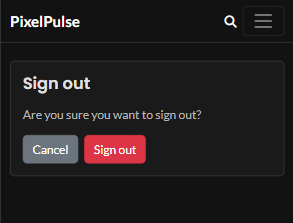
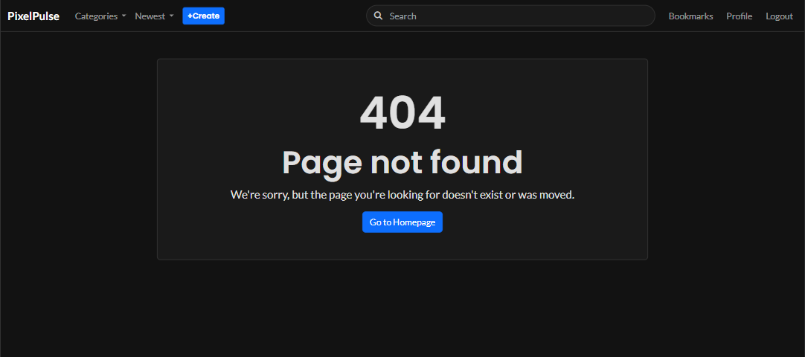
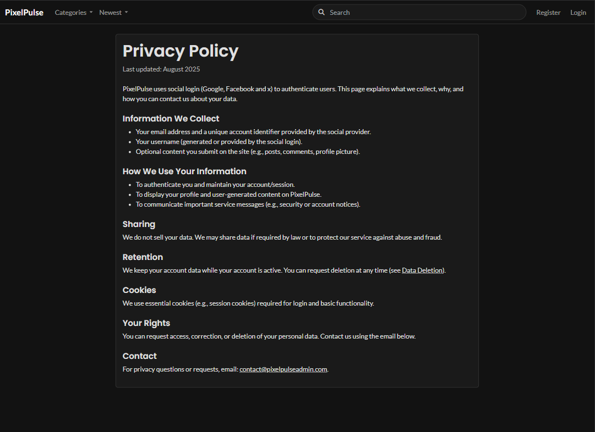

# PixelPulse digital Tech & Gaming Community
## **Site Overview**
PixelPulse is a community platform where users can share news and opinions about technology and gaming. Users can find out about new trends, share information with the community and exchange opinions.
Registered users can read posts and comments, as well as create their own. This fosters valuable interaction.

**[View the live project on Heroku](https://pixelpulse-220240cef270.herokuapp.com)**

## Table of contents:
1. [**Site Overview**](#site-overview)
2. [**Planning stage**](#planning-stage)
    * [**Strategy**](#strategy)
        * [***Site Aims***](#site-aims)
        * [***Scope***](#scope)
            * [**MoSCoW Scope for PixelPulse**](#moscow-scope-for-pixelpulse)
        * [**User Stories**](#user-stories)
            * [**Epic 1 - Content Browse**](#epic-1---content-browse)
            * [**Epic 2 - User Authentication & Authorization**](#epic-2---user-authentication-&-authorization)
            * [**Epic 3 - Content Contribution**](#epic-3---content-contribution)
            * [**Epic 4 - Interaction & Feedback**](#epic-4---interaction-&-feedback)
            * [**Epic 5 - Personalization**](#epic-5---personalization)
            * [**Epic 6 - Moderation & Governance**](#epic-6---moderation-&-governance)
            * [**Epic 7 - Social Authentication**](#epic-7---social-authentication)
        * [**User Stories out of Scope**](#user-stories-out-of-scope)
            * [**From Epic 7**](#from-epic-7)
            * [**Justification for Scope Reduction**](#justification-for-scope-reduction)
        * [***Flowchart***](#flowchart)
        * [***Wireframes***](#wireframes)
        * [***Database Schema***](#database-schema)
        * [***Color Scheme***](#color-scheme)
        * [***Typography***](#typography)
    * [**Agile Methodology**](#agile-methodology)
3. [**Features**](#features)
    * [**Across all pages**](#across-all-pages)
        * [**Navigation bar**](#navigation-bar)
            * [**Navbar Visitor view**](#navbar-visitor-view)
            * [**Navbar Registered user view**](#navbar-registered-user-view)
        * [**Footer**](#footer)
    * [**Main page content**](#main-page-content)
        * [**Main page Visitor view**](#main-page-visitor-view)
        * [**Card example Visitor view**](#card-example-visitor-view)
        * [**Main page Registered user view**](#main-page-registered-user-view)
        * [**Card example Registered user view**](#card-example-registered-user-view)
    * [**Post page content**](#post-page-content)
        * [**Post page content Visitor view**](#post-page-content-visitor-view)
        * [**Post page content Registered user view**](#post-page-content-registered-user-view)
        * [**Create Post**](#create-post)
            * [**Create Post success message**](#create-post-success-message)
        * [**Delete and Edit Post buttons**](#delete-and-edit-post-buttons)
        * [**Edit Post**](#edit-post)
            * [**Edit Post success message**](#edit-post-success-message)
        * [**Awaiting post approval information**](#awaiting-post-approval-information)
        * [**Delete Post warning**](#delete-post-warning)
        * [**Comment approval message**](#comment-approval-message)
        * [**Comment delete warning**](#comment-delete-warning)
        * [**Edit comment**](#edit-comment)
    * [**Account controls**](#account-controls)
        * [**Register**](#register)
            * [**Google authentication warning**](#google-authentication-warning)
        * [**Login**](#login)
            * [**Login success message**](#login-success-message)
        * [**Logout**](#logout)
            * [**Sign out success message**](#sign-out-success-message)
        * [**Profile Page**](#profile-page)
            * [**Own Profile Page**](#own-profile-page)
            * [**Open drafts on Profile Page**](#open-drafts-on-profile-page)
                * [**Profile Edit***](#profile-edit)
                    * [**Profile Edit success message**](#profile-edit-success-message)
        * [**Bookmarks**](#bookmarks)
            * [**Bookmark saved message**](#bookmark-saved-message)
            * [**Bookmarks unsaved message**](#bookmark-unsaved-message)
    * [**Error handling**](#error-handling)
        * [**403 forbidden**](#403-forbidden)
        * [**404 not found**](#404-not-found)
        * [**500 internal server error**](#500-internal-server-error)
        * [**Authentication error**](#authentication-error)
    * [**Privacy page**](#privacy-page)
    * [**Data deletion page**](#data-deletion-page)
4. [**Future Improvements**](#future-improvements)
5. [**Testing Phase**](#testing-phase)
6. [**Deployment**](#deployment)
7. [**Technologies used**](#technologies-used)
8. [**Credits**](#credits)
    * [***General reference***](#general-reference)
    * [***Content***](#content)
    * [***Media***](#media)

# **Planning stage**

## **Strategy**

### **Site Aims**

PixelPulse is for people who want to dive deeper into digital topics like programming, hardware, gaming, and esports—without wading through irrelevant news. Instead of volume, PixelPulse relies on community curation: worthwhile content is surfaced via votes, categories, search, and bookmarks; users can create, save, and discuss their own posts. This helps the community find quality faster, exchange ideas constructively, and stay together at the digital pulse of the times. For quality assurance, PixelPulse is moderated: new posts and comments are reviewed before publication.

* Quality: Focus on relevant, well-crafted content on programming, hardware, gaming & esports

* Community curation: Votes, categories, search, and bookmarks surface the best posts

* Exchange: Users write their own posts and discuss constructively and respectfully

* Goal: A growing community of like-minded people that saves time and reliably delivers quality

### **Scope**

Given the available time and the assessment criteria, the project scope required deliberate trade-offs. I followed an agile approach: defined Epics, User Stories, and Acceptance Criteria up front, tracked progress in GitHub Projects, and reprioritized iteratively. To sharpen the scope, I applied the MoSCoW method to weight requirements so a fully functional MVP could be delivered by the deadline.

#### ***MoSCoW Scope for PixelPulse***

*Must-Have*
* Create posts
* Create comments on posts
* Read posts and comments
* Update posts & comments
* Delete posts & comments
* Voting system for posts
* Saved/Bookmarks
* Categories
* Sorting
* Search function
* Responsive theme & essential UX
* Deployment on Heroku

*Should-Have*
* Moderation with pre-publication review for posts & comments
* Infinite scroll
* Profile editing (avatar, bio)
* Lightweight SEO (meta)

*Could-Have*
* Moderation for updated posts & comments
* Social login (Google, X, Facebook)
* Tags & topic following
* Youtube embeds

*Won’t-Have (for the MVP)*
* Advanced moderation tools (reports)
* Email Backend
* DMs/chat
* Advanced analytics

With these fundamental considerations and the clear time frame of the project, I was then able to take the next step using agile methods.

### **User Stories**
Using agile practices, I defined Epics, User Stories, and Acceptance Criteria, and managed the backlog in GitHub Projects. This structure highlighted the most important features, supported iterative planning and review each sprint, and ensured a shippable MVP by the deadline.

#### **Epic 1 - Content Browse**
* Goal: To enable users to discover and read available posts on the platform

    * As a user..

        * ...I can see a list of all posts on the homepage, so that I can quickly get an overview of current discussions and news.
            * Acceptance Criteria:
                * The homepage displays a list of posts.
                * Each post in the list shows its title, category, author, and a timestamp.
                * Each post in the list shows the number of comments and an option to vote (upvote/downvote).
                * Clicking on a post's title redirects me to that post's detail view.
                * Posts are sorted by creation date (newest first) by default

        * ...I can view the details of a selected post, so that I can read the full content and related discussions.
            * Acceptance Criteria:
                * The post detail page displays the full title, full text/media content, category, author, and timestamp.
                * The post detail page also displays the number of comments and voting options for the post.
                * The post detail page displays comments related to the post.

        * ...I can search for posts, so that I can quickly find specific content.
            * Acceptance Criteria:
                * A search field is visible on every page.
                * The search allows filtering posts by keywords in the title or content.
                * Search results are displayed on a separate page or by updating the current list.

        * ...I can filter posts by categories, so that I can find content related to specific interests.
            * Acceptance Criteria:
                * A category dropdown or navigation option is visible on the homepage.
                * When a category is selected, only posts from that category are displayed.

        * ...I can sort posts by popularity (number of upvotes) or date, so that I can see the most relevant or most recent content.
            * Acceptance Criteria:
                * Sorting options ("Newest", "Top") are available on the homepage.
                * The list of posts updates according to the selected sorting option.

#### **Epic 2 - User Authentication & Authorization**
* Goal: To enable users to securely register, log in, manage their profile, and perform authorized actions on the platform.

    * As a user...

        * ...I can register on the platform, so that I can create posts and interact with others.
            * Acceptance Criteria:
                * There is a clear registration option.
                * The registration process requires a unique username, email, and password.
                * Passwords must comply with specific security standards (e.g., minimum length, complexity).
                * Upon successful registration, the user is logged in and redirected to the homepage or a welcome screen.
                * Error messages are displayed for invalid inputs or duplicate usernames/emails.

    * As a registered user...

        * ...I can log in and log out of the platform, so that I can access my personal features and end my session.
            * Acceptance Criteria:
                * There is a clear login option.
                * Login requires a username/email and password.
                * Upon successful login, the user is logged in, and the login status is reflected in the header.
                * An error message is displayed for incorrect login credentials.
                * There is a logout option that logs the user out of the platform.

        * ...I can view my user profile and edit basic information, so that I can manage my personal details.
            * Acceptance Criteria:
                * The user can access their profile via navigation.
                * The profile displays basic user information (e.g., username, registration date).
                * The user can edit and save certain profile information (e.g., email).
            
        * ... I can change my password, so that I can ensure the security of my account.
            * Acceptance Criteria:
                * There is a password change option in the profile section.
                * The user must enter their current password before setting a new one.
                * New passwords must comply with specific security standards.

#### **Epic 3 - Content Contribution**
* Goal: To enable registered users to create, edit, and delete posts.

    * As registered user...

        * ...I can create a new post, so that I can share news or content with the community.
            * Acceptance Criteria:
                * A "Create" or "New Post" button is visible for logged-in users.
                * Clicking the button displays a form for creating a post.
                * The form includes fields for title, content (text/link/image URL), and category.
                * All required fields must be filled.
                * Upon successful creation, the post is published, and the user is redirected to the new post's detail view.

        * ...I can edit my own posts, so that I can correct errors or update content.
            * Acceptance Criteria:
                * An "Edit" option is visible on the detail page of my own post.
                * Clicking "Edit" displays the post form pre-filled with existing content.
                * Changes can be saved, and the post is updated.

        * ...I can delete my own posts, so that I can remove unwanted content.
            * Acceptance Criteria:
                * A "Delete" option is visible on the detail page of my own post.
                * Clicking "Delete" displays a confirmation prompt (e.g., a modal).
                * After confirmation, the post is permanently deleted.
                * The user is redirected to the homepage after deletion.

#### **Epic 4 - Interaction & Feedback**
* Goal: To enable users to interact with posts and comments (voting, commenting).

    * As registered user...

        * ...I can upvote and downvote posts, so that I can rate the relevance or quality of content.
            * Acceptance Criteria:
                * Upvote and downvote buttons are visible on every post.
                * Clicking upvote/downvote updates the vote count for the post.
                * A user can only upvote or downvote a post once.
                * A user can change their vote (e.g., from upvote to downvote or vice versa).

        * ...I can add comments to posts, so that I can contribute my opinion or additional information.
            * Acceptance Criteria:
                * A comment form is visible on the post detail page (only for logged-in users).
                * The form allows entering text and submitting the comment.
                * After submission, the comment is displayed below the post (initially flat).
                * Error messages are displayed for empty comments.

        * ...I can edit my own comments, so that I can correct or refine my feedback.
            * Acceptance Criteria:
                * An "Edit" option is visible on my own comment.
                * Clicking it makes the comment text editable.
                * Changes can be saved, and the comment is updated.

        * ...I can delete my own comments, so that I can remove unwanted feedback.
            * Acceptance Criteria:
                * A "Delete" option is visible on my own comment.
                * Clicking it displays a confirmation prompt.
                * After confirmation, the comment is permanently deleted

#### **Epic 5 - Personalization**
* Goal: To enable users to customize their experience on the platform.

    * As registered user...

        * ...I can save posts, so that I can easily find them again later.
            * Acceptance Criteria:
                * A "Save" button or icon is visible on every post.
                * Saved posts can be accessed via a dedicated page in the user profile

        * ...I can upload a profile picture, so that I can personalize my profile.
            * Acceptance Criteria:
                * In the profile editing area, there is an option to upload an image.
                * The uploaded image is displayed on the profile and next to posts/comments.

#### **Epic 6 - Moderation & Governance**
* Goal: To enable administrators and moderators to manage platform content and users.

    * As an administrator...

        * ...I can ensure content quality and policy compliance.
            * Acceptance Criteria:
                * Administrators have access to a backend interface (Django Admin).
                * Posts and comments can be edited and deleted in the Admin area.

        * ...I can intervene in cases of rule violations..
            * Acceptance Criteria:
                * Administrators can activate/deactivate or delete user accounts in the Django Admin.

#### **Epic 7 - Social Authentication**
* Goal: To enable users to register and log in via social media, to simplify the registration process and improve user-friendliness.

    * As a user...

        * ...I can register and log in with my Google account, so that I can quickly and easily use the platform.
            * Acceptance Criteria:
                * "Sign in with Google" option is visible on login/registration pages.
                * After successful Google authentication, a user account is created and the user is logged in.
                * A user who has already registered via Google can log in again using the same button.

### **User Stories out of Scope**

#### **From Epic 7**

* ...I can register with my Facebook account, so that I can quickly and easily complete the registration process.
    * Acceptance Criteria:
        * The user can see a "Sign up with Facebook" option on the registration page.
        * Clicking the "Sign up with Facebook" option redirects the user to the Facebook login page.
        * After successful login with Facebook, the user is redirected to a confirmed account on the website.
        * A new user profile is automatically created with information provided by Facebook.
        * The user is automatically logged in after registration/login.
        * Facebook login errors are displayed to the user accordingly.

* ...I can register with my X (Twitter) account, so that I can quickly and easily complete the registration process.
    * Acceptance Criteria:
        * The user can see a "Sign up with X" option on the registration page.
        * Clicking the "Sign up with X" option redirects the user to the X login page.
        * After successful login with X, the user is redirected to a confirmed account on the website.
        * A new user profile is automatically created with information provided by X (username, email).
        * The user is automatically logged in after registration/login.
        * X login errors are displayed to the user accordingly.

#### **Justification for Scope Reduction**
User Stories 7.2 and 7.3, which were originally planned, were removed from the project's scope during development. This was not due to technical implementation issues within the project, but rather to unforeseen, external hurdles imposed by the platform providers.

*Social Login via Facebook*
The implementation of the login via Facebook was technically completed and successfully tested in developer mode. However, a public release for all users failed due to the following requirements from the Meta Developer Platform:
* Business Verification: To publish an app with a login function, official business verification is required. As a private individual, it was not possible to meet this requirement.
* App Review: The App Review process, which is mandatory for publication, also requires business verification and therefore could not be completed.
An inquiry to Facebook Support regarding a possible exception for this academic project unfortunately did not receive a helpful response. Without the app's publication, the feature is not accessible to end-users.

*Social Login via X (formerly Twitter)*
Similar to the Facebook integration, the connection to the X API was technically prepared. However, its completion was prevented by the recently and significantly changed terms of use for the X Developer Platform:
* Registration Hurdles: Registration on the developer platform was temporarily unavailable for several days due to ongoing changes by X.
* API Access Level: After successful setup, the authorization request was rejected by the X API with a 403 Forbidden status code. Intensive research revealed that the cause is the new tier structure of the X API: The free "Free" tier is no longer sufficient to access the endpoint required for the social login process.
* Costs: An upgrade to the required "Basic" tier, which would grant access, costs $100 per month. These costs exceed the scope of this project at this time.
For these reasons, the user story for the X login could not be completed.

### **Flowchart**
This flowchart visualizes the planned user journey through the core functions of the website, based on our planning to date. Adjustments are possible in the agile development process, but the overall structure shown forms a stable foundation.

### **Wireframes**
I created wireframes for this project to organizes my ideas and not lose focus. See the links below for the mobile and desktop versions of the four wireframes.

*Homepage*
* Desktop wireframes:
[Home page](/docs/wireframes/home-desktop.png)

* Mobile wireframes:
[Home page](/docs/wireframes/home-mobile.png)

*Post Page*
* Desktop wireframes:
[Post Page](/docs/wireframes/post-page-desktop.png)

* Mobile wireframes:
[Post Page](/docs/wireframes/post-page-mobile.png)

Although the structure outlined in the original wireframes was largely preserved, several small changes became necessary during the course of the project to ensure a functional and visually appealing experience for players across all screen sizes:

* The functions for content filtering (by category) and sorting (by date/popularity) have been split into two separate drop-down menus. This architectural decision ensures that both operations can be performed independently of each other and combined with each other, which increases the flexibility of data presentation.
* The navigation buttons for the user account (profile, logout, etc.) were deliberately designed as individual elements to maximize accessibility and user-friendliness.

These changes explain why the final project differs in certain aspects from the originally created wireframes.

### **Database Schema**
I have created a database schema using dbdiagram.io based on my considerations so far.

### **Color Scheme**

The color palette was specifically chosen to create a modern, technology-focused atmosphere that evokes the aesthetic of gaming and software development.  A dark theme forms the foundation to improve readability during longer sessions, reduce eye strain, and allow content such as images and links to stand out.
To create the color palette, I used https://coolors.co.
The palette consists of five main colors:
* "Night" - A near-black background creates an immersive environment and provides a strong visual focus.
* "Platinum" - A bright, off-white text ensures maximum legibility and contrast.
* "Jet" - A dark, charcoal gray that serves as a subtle border and separator color. It is used to outline components like cards and the navigation bar, providing structure to the layout without distracting from the main content.
* "Lime Green - A vibrant green serves as the accent color. It was chosen for its association with classic computer terminals and cyberpunk aesthetics, and it is used strategically to highlight important interactive elements like buttons, links, and voting statistics.
* "Brandels blue" - For primary 'call to action' buttons, I used Bootstrap's default blue. It provides a familiar and strong visual contrast to the custom theme, clearly highlighting the most important user actions for better usability.

### **Typography**
* [Poppins](https://fonts.google.com/specimen/Poppins) - For headings
* [Lato](https://fonts.google.com/specimen/Lato) - For text
With Poppins for the headings and Lato for the body text, I chose a font combination that ensures both a modern aesthetic and excellent readability, especially in the dark theme.

## **Agile Methodology**
To support the agile development process, I used [GitHub Projects](https://github.com/users/ksstrat/projects/8) to ensure organization and progress management. The issues derived from the user stories were managed in a Kanban board with the columns “To Do,” “In Progress,” and “Done.” The iterations were also recorded in a separate file that you can find [here](AGILE.md). This allowed me to maintain an overview at all times, focus on the essentials, and drive the project forward in a targeted manner.

# **Features**

## Across all pages

### Navigation bar
Provides consistent navigation across devices. The layout is responsive, available actions are optimized for the current auth state (visitor vs. signed-in).

#### Navbar Visitor view
* When you’re not signed in, the navigation bar includes:
    * PixelPulse logo (links to Home)
    * Categories dropdown (filter posts by category)
    * Sort dropdown (Newest | Top)
    * Search bar (full-text search)
    * Sign up link
    * Log in link

##### Desktop
###### Complete navbar

###### Categories dropdown

###### Sort dropdown

###### Search bar

##### Mobile
* In mobile view, the navigation bar shows the logo, a search icon, and a hamburger menu.
    * The search icon expands a full-width search bar
    * The hamburger menu opens the navigation drawer with all primary navigation items

###### Complete navbar

###### Search bar

###### Search bar (highlighted)

###### Hamburger menu

###### Categories dropdown

###### Sort dropdown

#### Navbar Registered user view
* When you’re signed in, the navigation bar includes the following controls:
    * New post button
    * Bookmarks link
    * Profile link
    * Log out link (replaces sign up / log in)

##### Desktop
###### Complete navbar

##### Mobile
###### Complete navbar

###### Hamburger menu

### Footer
* Links to the privacy policy and data deletion pages and includes the copyright notice.
#### Desktop

#### Mobile

### Leaving domain warning
* Whenever the user clicks a link to an external destination, there will be a warning.
#### Desktop

#### Mobile

## Main page content
* The main Page content is a feed of posts shown as separated cards:
    * The site can be scrolled infinite (as long as there is content)
    * The Cards are a preview of the posts showing:
        * Category Tag
        * Author
        * Timestamp
        * Title
        * Image
        * Comment Icon and count
        * Bookmark Icon
        * Up and down vote icons and vote count

### Main page Visitor view
* Bookmarks, vote icons and counts are hidden to visitors, instead they see a "Log in to vote" button.
#### Desktop

#### Mobile

### Card example Visitor view
#### Desktop

#### Mobile

### Main page Registered user view
* Registered user can see and interact with the bookmark icon or the vote icons.
#### Desktop

#### Mobile

### Card example Registered user view
#### Desktop

#### Mobile

## Post page content
* The post page adopts the card layout of the main page but expands on it.
### Post page content Visitor view
* As a visitor, the user can read the post and comments here, but cannot write their own comments. The bookmark icon and vote buttons remain hidden in this view.
#### Desktop

#### Mobile

### Post page content Registered user view
* Registered users can see the bookmark icon, as well as the up and down votes, and interact with them.
* They will see a text editor in which they can add a comment to the post.
#### Desktop

#### Mobile

### Create Post
* Only registered users can interact with the 'Create' button and write their own posts.
* Clicking on the ‘Create’ button opens the Create form. Here, the user can:
    * Enter a title.
    * Select a category.
    * Write a post.
    * Select an image.
    * Link a URL.
* After that, he can decide whether to publish or reject the post.

#### Desktop

#### Mobile

#### Create Post success message
* Once the user has decided to publish the post, they receive a success message indicating that their post is now being reviewed.
#### Desktop

#### Mobile

### Delete and Edit Post buttons
* As the author of a post, a user can edit or delete it at any time. The relevant buttons are available directly below the content section.
#### Desktop

#### Mobile

### Edit Post
* If he decides to edit the post, the 'Edit Post' form will open.
    * Here, he can edit all fields again.
    * Users can only edit posts they have written themselves.
#### Desktop

#### Mobile

### Edit Post success message
* If he decides to confirm the changes, he will receive another confirmation message. However, the post must then be reviewed again by an admin/staff member.
#### Desktop

#### Mobile

### Awaiting approval information
* As long as the post is in approval, the author of the post will see a message on the post page.
#### Desktop

#### Mobile

### Delete Post warning
* If a user decides to delete their post, they will receive a warning beforehand.
    * Users can only delete posts that they have written themselves.
* After deletion, the user is redirected to the main page.
#### Desktop

#### Mobile

### Comment approval message
* If a comment is written using the text editor on the post page, a success message appears with a note about the comment being reviewed.
#### Desktop

#### Mobile

### Comment delete warning
* If a user decides to delete their comment, they will receive a warning beforehand.
    * Just like with posts, users can only delete their own comments.
#### Desktop

#### Mobile

### Edit comment
* A user can edit their comment at any time.
    * Here, too, users can only edit their own comments.
#### Desktop

#### Mobile

## Account controls
* Account authentication is controlled via Django Allauth.
* Users can choose whether they want to register with their email address and password or use Google's social login.
* When registering manually, certain security standards must be met by the chosen password.

### Register
#### Desktop

#### Mobile

#### Google authentication warning
* Before the user can complete authentication via Google, they receive a warning.
##### Desktop

##### Mobile

### Login
* Login is then possible using the credentials selected during manual registration or via social authentication.
#### Desktop

#### Mobile

#### Login success message
* After successfully logging in, the user is greeted with a success message on the main page.
##### Desktop

##### Mobile

### Logout
* If the user decides to log out, they will receive a warning beforehand.
#### Desktop

#### Mobile

#### Sign out success message
* After logging out, the user is redirected to the main page and receives a success message.
##### Desktop

##### Mobile

### Profile Page
* The profiles of users who participate in posts and comments are publicly viewable.
    * Here you can see which posts the respective user has written.
#### Desktop

#### Mobile

#### Own Profile Page
* When users access their own profile page, they can edit their profile or change their password.
##### Desktop

##### Mobile

#### Open drafts on Profile Page
* In addition, users can see on their own profile whether further approvals for their posts are pending. This information is only displayed to the respective user.
##### Desktop

##### Mobile

#### Profile Edit
* If the user decides to edit their profile, the edit profile form opens.
    * Here, he can change his profile picture or update his email address.
##### Desktop

##### Mobile

##### Profile Edit success message
* When the user makes changes, they receive a success message upon successful completion.
###### Desktop

###### Mobile

### Bookmarks
* After clicking on the navigation point ‘Bookmarks’, the user is taken to an overview of the bookmarks they have set.
    * Here he can see an overview of all the posts he has saved.
#### Desktop

#### Mobile

#### Bookmark saved message
* When a user sets a new bookmark, they receive a success message stating that the post has now been saved.
    * This post will then be displayed in the user's bookmark overview.
##### Desktop

##### Mobile

#### Bookmarks unsaved message
* He also receives a success message when he un-saves a bookmark.
    * This post will then no longer be displayed in the user's bookmark overview.
##### Desktop

##### Mobile

## Error handling
* To improve the user experience, custom status pages were created for the different error codes.
### 403 forbidden
### Desktop

### Mobile

### 404 not found
### Desktop

### Mobile

### 500 internal server error
### Desktop
![Desktop 500 internal server error]
### Mobile
![Mobile 500 internal server error]

### Authentication error
* If an error occurs during a social login attempt, the user will be informed.
### Desktop

### Mobile

## Privacy page
* Since providers of social auth APIs are required to have a privacy policy, I have created a corresponding template.
### Desktop

### Mobile

## Data deletion page
* Some providers of social login solutions also require a data deletion page.
### Desktop

### Mobile

# **Future Improvements**
* While some initially planned features were de-scoped due to external factors, the agile development process also generated many new ideas for future enhancements. The most promising of these are listed below as potential next steps beyond the current MVP.
    * Build a thriving online community.
    * Further Social Logins - GitHub, Microsoft, and perhaps even Meta and X, if the necessary resources are available.
    * Implementation of Youtube embeds.
    * Connecting an email backend.
    * Email verification and Password reset by Mail.
    * Private messaging service for users.
    * Push notifications for new posts in subscribed categories.
    * Nested comments (comment function for comments).
    * Advanced user moderation tools (reports).
    * Bookmark Counter: How many people have bookmarked this post?
    * Expansion of available filters. For example, 'Trending' and 'Most Bookmarked'.
    * Enhance the admin backend by adding more functions, such as batch approval.
    * Automatic checking of comments and posts for harmful content (e.g. NSFW or netiquette violations).
    * A display for recent comments.

***
# **Testing Phase**
I have documented the testing processes, both during and after development, in a separate file named [TESTING.md](TESTING.md).

***
# **Deployment**

A live version of this project is deployed on Heroku, you can find it [here](https://pixelpulse-220240cef270.herokuapp.com).

For detailed instructions on how to set up and deploy your own instance of this project, please see the [DEPLOYMENT.md](DEPLOYMENT.md) file.

***
# **Technologies used:**

## Project planing
* Balsamiq: Used to create wireframes for this project
* Lucidcharts: The Flowchart was created using lucid.app
* dbdiagram.io: The ERD was created using dbdiagram.io
* I used VS Code for local developing.

## Backend
* Python: Used as the core backend programming language for the entire application logic.
* Django: The high-level Python framework used to build the robust structure, views, and logic of the web application.
* gunicorn: The WSGI HTTP server used to run the Python web application in the Heroku production environment.
* django-allauth: The integrated Django application used to handle all user authentication, including standard registration/login and social logins (Google).
* django-crispy-forms: The Django application used to control the rendering of forms, allowing them to be styled easily with Bootstrap 5.
* django-summernote: The WYSIWYG (What You See Is What You Get) editor integrated into forms for creating rich text content for posts and comments.

## Frontend
* HTML: The markup language used for structuring the content and templates of all web pages.
* CSS: The styling language used to define the visual appearance, layout, and the custom dark theme of the application.
* JavaScript: Used for client-side interactivity, specifically for implementing the external link warning modal.
* Bootstrap 5: The powerful frontend framework used for creating the responsive grid layout and styling standard components like buttons and cards.

## Databases & Services
* PostgreSQL: The production-ready relational database used via Heroku Postgres to store all application data, including users, posts, and comments.
* Cloudinary: The cloud-based service used for storing, managing, and serving all user-uploaded media files, such as featured images and avatars.
* Font Awesome: The icon toolkit used to provide a consistent set of icons throughout the user interface (e.g., for voting, comments, and navigation).

## Development & Deployment
* Heroku: The cloud Platform as a Service (PaaS) used for deploying, hosting, and managing the live production version of the web application.
* Git: The version control system used to track changes to the codebase throughout the project's development.
* GitHub: The platform for hosting the Git repository, managing the project's source code, and tracking the agile workflow via GitHub Projects.
* dj_database_url: A utility used to parse the database connection URL from the environment, simplifying database configuration for Heroku.
* Markdown: The lightweight markup language used for formatting all project documentation files, including README.md, AGILE.md, DEPLOYMENT.md and TESTING.md.

# **Credits**

## **General reference:**
* I would like to thank my mentor, Richard Wells, for his guidance and support.
* The project drew inspiration from the Code Institute's code-along project “I Think Therefore I Blog” and the Portfolio 4 Assessment Guide. Although I aimed to deviate as much as possible, there may still be some similarities in the code structure.
* The design is inspired by the social platform reddit.
* Throughout the project, I used several documentations in particular Django, Python, bootstrap, w3schools as primary resources for guidance and reference.
* The YouTube channels Cloud With Django, JimShapedCoding and Andreas Jud
* Special thanks go to my numerous beta testers, who are friends, family and relatives.

### **Media:**
Images for the posts and profile pictures were taken from:
 * [pixabay.com](https://pixabay.com)
 * [pexels.com](https://www.pexels.com)
 * [pcgamer.com](https://www.pcgamer.com)
 * [www.securityweek.com](https://www.securityweek.com)
 * [wccftech.com](https://wccftech.com)
 * [esportsinsider.com](https://esportsinsider.com)

