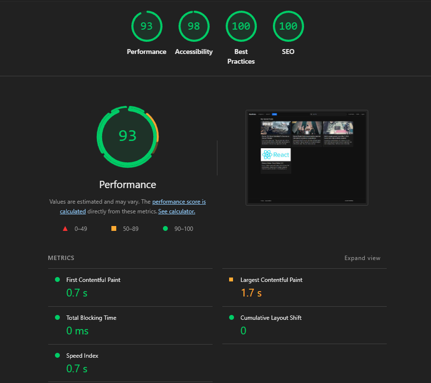
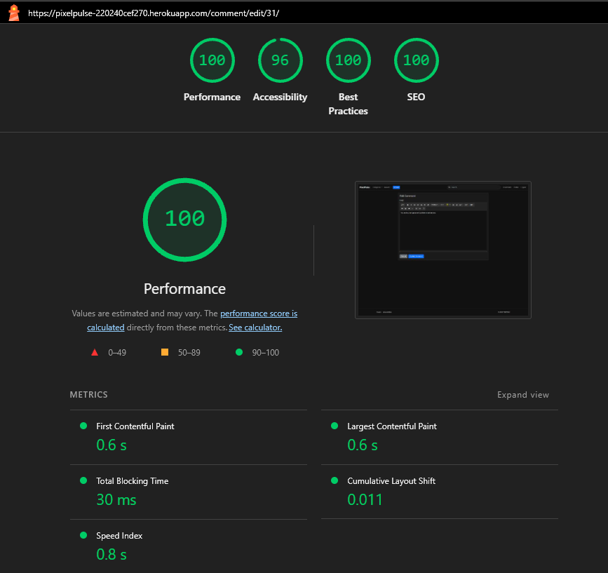
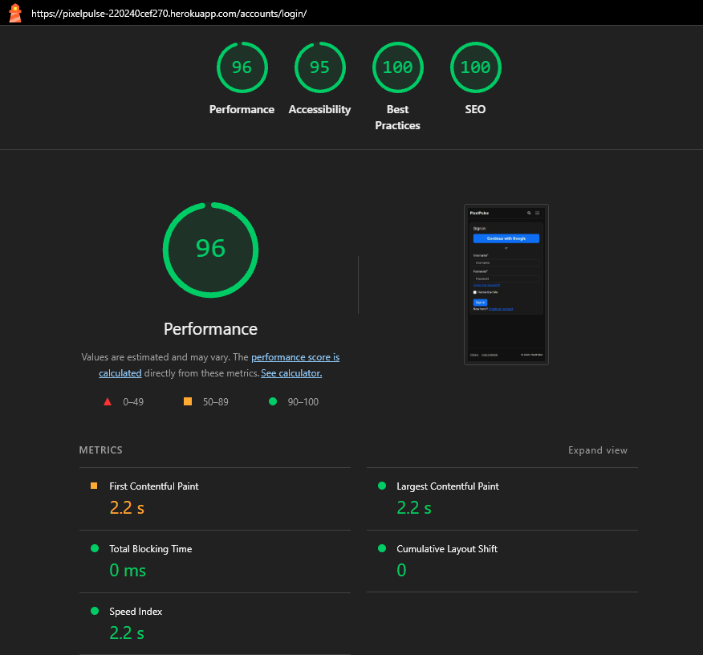
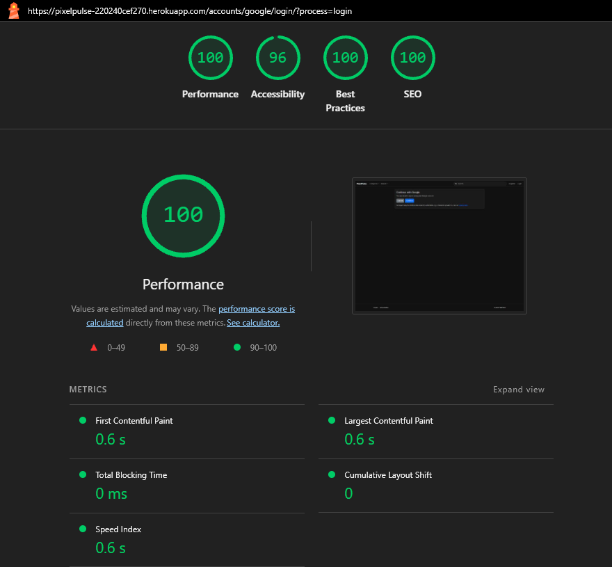
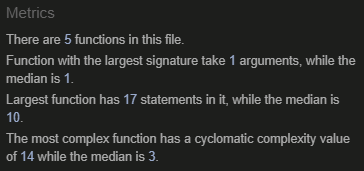

# Testing

* [Testing](#testing)
* [Bugs and Fixes During the Development Process](#bugs-and-fixes-during-the-development-process)
* [Wave Aim Accessibility checker:](#wave-aim-accessibility-checker)
* [Lighthouse](#lighthouse)
    * [Main Page](#main-page)
    * [Post Page](#post-page)
    * [Profile Page](#profile-page)
    * [Privacy Page](#privacy-page)
    * [Data Deletion](#data-deletion)
    * [Bookmarks](#bookmarks)
    * [Create post](#create_post)
    * [Edit Post](#edit-post)
    * [Edit Profile](#profile-edit)
    * [Edit Comment](#edit-comment)
    * [Login](#login)
    * [Logout](#logout)
    * [Register](#register)
    * [Google Auth](#google-auth)
    * [Change Password](#change-password)
* [Validators](#validators)
  * [HTML:](#html)
  * [CSS:](#css)
  * [JS:](#js)
  * [PEP8:](#pep8)
* [Manual testing](#manual-testing)
  * [Epic 0](#epic-0)
  * [Epic 1](#epic-1)
  * [Epic 2](#epic-2)
  * [Epic 3](#epic-3)
  * [Epic 4](#epic-4)
  * [Epic 5](#epic-5)
  * [Epic 6](#epic-6)
  * [Epic 7](#epic-7)

---

  # Bugs and Fixes During the Development Process
  While working on this project, I created a brief note for each commit to fix an issue, describing the problem, its cause and the solution. This chapter summarizes all 'fix' commits in chronological order. Each entry follows the order Issue → Cause → Solution.

---

    1. Corrected template file path for base.html
    - **Issue:** Template rendered incorrectly.
    - **Cause:** Template tag.
    - **Solution:** Fixed template code.
---

    2. Correct typo in INSTALLED_APPS list
    - **Issue:** Typo in INSTALLED_APPS.
    - **Cause:** Misspelled word.
    - **Solution:** Corrected spelling.

---

    3. Correct default image to default.png
    - **Issue:** Default image wasn't shown.
    - **Cause:** Incorrect implementation in the template.
    - **Solution:** Corrected implementation.
---

    4. Revert incorrect migration for Category model
    - **Issue:** Incorrect migration of the category model.
    - **Cause:** Swapping the lines in models.py.
    - **Solution:** The migration was reversed and the code corrected..

---

    5. Add missing endif in post_detail.html
    - **Issue:** Template was broken.
    - **Cause:** Endif was missing in the Template.
    - **Solution:** Corrected implementation.

---

    6. Add missing comma in main urls.py
    - **Issue:** Incorrect paths.
    - **Cause:** Overlooked comma in urls.py.
    - **Solution:** Corrected implementation.

---

    7. Correct 'revers' typo to 'reverse' in models.py
    - **Issue:** Typo broke the models.py.
    - **Cause:** Misspelled word.
    - **Solution:** Corrected spelling in models.py.

---

    8. Move get_absolute_url to Post model
    - **Issue:** Method was in the wrong model.
    - **Cause:** Lines confused.
    - **Solution:** Corrected implementation.

---

    9. Correct "puls" typo to "pulse" in Procfile
    - **Issue:** Deployment on Heroku was not possible; the website was always blank.
    - **Cause:** I forgot the e in pulse.
    - **Solution:** Corrected spelling in Procfile.
    -> This "Bug" took me very long. I only thought of checking the procfile again later on.

---

    10. Correct VoteView logic for get_or_create
    - **Issue:** votes counted incorrectly.
    - **Cause:** error in the vote view logic.
    - **Solution:** logic of vote view corrected.

---

    11. Correct default image to default.png on homepage
    - **Issue:** Template was broken.
    - **Cause:** Similar error as in 3. File name in template differed from actual file name.
    - **Solution:** Corrected implementation and added a quick smoke test

---

    12. Add missing django-allauth constants
    - **Issue:** Authentication flow misbehaved.
    - **Cause:** Misconfiguration.
    - **Solution:** Adjusted allauth settings.

---

    13. Combine vote buttons into a single form in index.html
    - **Issue:** Incorrect voting behavior.
    - **Cause:** Two different forms for the buttons.
    - **Solution:** Corrected form.

---

    14. Correct URL pattern order in posts/urls.py
    - **Issue:** Broken navigation.
    - **Cause:** Wrong URL name.
    - **Solution:** Updated URL patterns.

    15. Add missing CreateView import in posts/views.py
    - **Issue:** View was broken.
    - **Cause:** Import was missing.
    - **Solution:** Corrected implementation.

---

    16. Correct script loading order in base.html
    - **Issue:** Template was broken.
    - **Cause:** Wrong order of script loading.
    - **Solution:** Corrected implementation.

---

    17. Combine vote buttons into a single form in post_detail.html
    - **Issue:** Incorrect voting behavior.
    - **Cause:** Same as in 13, two different forms for the buttons.
    - **Solution:** Corrected form.

---

    18. Add missing PostCreate import in posts/urls.py
    - **Issue:** URLs were broken.
    - **Cause:** Import was missing.
    - **Solution:** Corrected implementation.

---

    19. Render post and comment content as safe HTML
    - **Issue:** HTML tags were visible in frontend.
    - **Cause:** missing safe Tag.
    - **Solution:** Corrected implementation.

---

    20. Add correct allauth change password link to user_pofile.html
    - **Issue:** URL was broken.
    - **Cause:** Misconfiguration of user_profile.html
    - **Solution:** Adjusted template.

---

    21. Remove password change link in user_profile.html for later implementation
    - **Issue:** Password change was broken
    - **Cause:** Implementation was incomplete
    - **Solution:** Temporarily removed link to password change.

---

    22. Remove incorrect form_valid method from DeleteView
    - **Issue:** DeleteView was broken.
    - **Cause:** Incorrect method was added.
    - **Solution:** Corrected implementation.

    23. Correct login_required decorator for PostDetail view
    - **Issue:** View was broken.
    - **Cause:** Wrong/missing decorator.
    - **Solution:** Fixed the decorator.

---

    24. Remove 'integrity' attribute from Bootstrap script to fix dropdown functionality
    - **Issue:** Website was broken.
    - **Cause:** The integrity value of the Bootstrap script, copied from the official site, crashed the system.
    - **Solution:** Removed integrity value.
    -> That took me a lot of time. I found the solution thanks to Reddit.

---

    25. Renamed total_votes to votes_sum to avoid conflicts with the existing total_votes and using annotate for correct 'top' sorting
    - **Issue:** Top sorting was incorrect.
    - **Cause:** The logic wasn't well thought out.
    - **Solution:** Fixed logic.

---

    26. Correct 'top' sorting by using Coalesce to handle null vote values
    - **Issue:** Issue was related to 25.
    - **Cause:** The calculation was incorrect.
    - **Solution:** Implemented Coalesce.

___

    27. Revert Prettier formatting in HTML files due to template tag rendering errors
    - **Issue:** Template was broken.
    - **Cause:** I tried to format the Django template language with Prettier.
    - **Solution:** Revert Prettier formatting.

---

    28. Correct redundant queryset and get_queryset in PostList view
    - **Issue:** View was broken.
    - **Cause:** Incorrect use of queryset.
    - **Solution:** Corrected use of queryset.

---

    29. Correctly handle form validation and context data in UserProfileUpdate view
    - **Issue:** Form failed validation.
    - **Cause:** Incorrect logic.
    - **Solution:** Corrected logic.

---

    30. Add missing 'render' import in views.py
    - **Issue:** View was broken.
    - **Cause:** Import was missing.
    - **Solution:** Corrected implementation.

---

    31. Add missing comma after 'django_extensions' in INSTALLED_APPS
    - **Issue:** INSTALLED_APPS was not set up correctly.
    - **Cause:** Missing commas.
    - **Solution:** Corrected implementation.

---

    32. Add author permission check to PostUpdate view
    - **Issue:** Anyone could edit and steal other people's contributions.
    - **Cause:** Incomplete implementation, not defensive enough.
    - **Solution:** Corrected implementation.

---

    33. Restrict access to draft posts
    - **Issue:** Related to 32. Other users could edit drafts.
    - **Cause:** Incomplete implementation, not defensive enough.
    - **Solution:** Corrected implementation.

---

    34. Prevent direct redirection to external URLs from the index page
    - **Issue:** Direct redirection to external URLs by clicking on title.
    - **Cause:** Misconfiguration the template.
    - **Solution:** Adjusted template settings.

---

    35. Make post media clickable on index page
    - **Issue:** Image of posts was not clickable on index page.
    - **Cause:** Incorrect implementation.
    - **Solution:** Corrected implementation.

----

    36. Render saved post content as safe HTML to remove tags
    - **Issue:** HTML tags were visible in frontend. (same as 19)
    - **Cause:** Missing safe tag in template.
    - **Solution:** Corrected implementation.

---

    37. Prevent HTML tags from showing in comment body in admin panel
    - **Issue:** HTML tags were visible in admin panel (similar to items 19 and 36).
    - **Cause:** Incomplete implementation of admin.py
    - **Solution:** Corrected implementation.

---

    38. Handle storage errors in PostCreate and PostUpdate and show inline form error
    - **Issue:** The user was not given any feedback.
    - **Cause:** Incorrect implementation.
    - **Solution:** Corrected logic.

---

    39. Handle storage errors in PostCreate and show inline form error
    - **Issue:** The user was not given any feedback.
    - **Cause:** Incorrect implementation (as in 38).
    - **Solution:** Corrected logic.

---

    40. Remove __pycache__ from version control
    - **Issue:** Repository contained Python cache artifacts.
    - **Cause:** Cache files were accidentally tracked.
    - **Solution:** Removed artifacts and updated .gitignore.

---

    41. Resolve text overflow in saved_posts.html by stripping tags
    - **Issue:** Text overflow in saved_posts.html
    - **Cause:** Incomplete implementation.
    - **Solution:** Adding stripping tags.

---

    42. Properly close "Login/Signup" comment in style.css
    - **Issue:** Style was broken.
    - **Cause:** A curly bracket was missing at the end of the CSS.
    - **Solution:** Add the curly bracket.

---

    43. Color of .text-muted corrected globally for project theme
    - **Issue:** The color didn't fit the theme.
    - **Cause:** Bootstrap.
    - **Solution:** Color overwritten.

---

    44. Validate only new uploads; don’t require image re-upload on post edit
    - **Issue:** Issue related to: validate only new uploads; don’t require image re-upload on post edit
    - **Cause:** Incorrect or incomplete implementation
    - **Solution:** Corrected implementation and added a quick smoke test

---

    45. Add * to .pyc in gitignore
    - **Issue:** Repository contained Python cache artifacts
    - **Cause:** Cache files were accidentally tracked
    - **Solution:** Removed artifacts and updated .gitignore

---

    46. Stop tracking .pyc files
    - **Issue:** Repository contained Python cache artifacts
    - **Cause:** Cache files were accidentally tracked
    - **Solution:** Removed artifacts and updated .gitignore

---

A major bug/error is not listed here, as it did not result in a ‘fix:’ commit.
I accidentally pushed a .cert and a .key to the repo because I forgot to include them in the .gitignore file. I needed HTTPS locally to try Facebook social authentication and didn't think about the fact that these files would then also be pushed. I immediately added the two files to the .gitignore, deleted them from the repo, and regenerated the keys.

# Wave Aim Accessibility checker
To check the Accessibility, i used [WAVE](https://wave.webaim.org)
During WAVE testing, two contrast issues were identified. I made small color adjustments to improve legibility:
- Author links previously used the default blue, underlined hyperlink style, which was hard to read on the dark background. I switched to Bootstrap’s bright yellow (link-warning) for clearer differentiation and stronger contrast.
- The “Log in to vote” button shown to visitors originally used a dark style. I changed it to the site’s standard blue (btn-primary) for better contrast and consistency with other buttons.

One WAVE error remains:

It stems from the mobile search bar implementation. Both the “open search” icon and the “close ×” control are label elements bound to the same hidden input (for="ppSearchOpen"). While multiple labels are valid HTML, accessibility tools expect a unique label per control; duplicates can confuse screen readers, so WAVE flags this as an error. In practice, the impact here is minimal. Re-implementing the control (e.g., replacing the close label with a button) was out of scope and is noted as a future improvement.

---

# **Lighthouse**

## Main Page
### Desktop

### Mobile

## Post Page
### Desktop

### Mobile

## Profile Page
### Desktop

### Mobile

## Privacy Page
### Desktop

### Mobile

## Data Deletion
### Desktop

### Mobile

## Bookmarks
### Desktop

### Mobile

## Create post
### Desktop

### Mobile

## Edit Post
### Desktop

### Mobile

## Edit Profile
### Desktop

### Mobile

## Edit Comment
### Desktop

### Mobile

## Login
### Desktop

### Mobile

## Logout
### Desktop

### Mobile

## Register
### Desktop

### Mobile

## Google Auth
### Desktop

### Mobile

## Change Password
### Desktop

### Mobile

## Evaluate Lighthouse Results
Across the site, most metrics were outstanding. Only the mobile, form-heavy pages tested slightly lower.
Overall, the values are satisfactory and do not require further optimization.
In hands-on use on both Android and iOS, I didn’t observe any noticeable performance degradation.

# **Validators**
## HTML:

## CSS:

[CSS Valiation](https://jigsaw.w3.org/css-validator/validator.html.en)

The CSS code was free of errors.

## JS:

[JS Validation](https://jshint.com)

JShint initially gave me three warnings:

I have identified most of these errors.

- Missing "use strict" — added 'use strict'; at the top of the script.
- Undefined global bootstrap — declared it for JSHint with /* global bootstrap */.
- “Optional catch binding” requires ES2019 — enabled ES2019 in JSHint via /* jshint esversion: 10 */.

But after this adjustments, i got a new error:

I identified this as a configuration error in the tool. I therefore did not make any further adjustments to the JavaScript.

## PEP8:

All files have been successfully checked with the CI Python Linter and are PEP8 compliant.

[PEP8 Va](https://pep8ci.herokuapp.com):

posts/admin.py:

posts/app.py

posts/forms.py

posts/models.py

posts/urls.py

posts/views.py

pixelpulse/settings.py

pixelpulse/urls.py

# **Manual testing**:

To verify functionality, enforce scope, and guide manual testing, the project’s epics, user stories, and acceptance criteria were consolidated into a concise checklist.

## Epic 0 
**Platform & Access**

passed | **Access a live URL** so that I can **use the site on any device**.  
|:---:|:---|
|&check;| Can access the site via the deployed URL on desktop.  
|&check;| Can access the site via the deployed URL on mobile.  
|&check;| Can access the site via the deployed URL on a tablet.  
|&check;| All images, scripts and styles load correctly on first visit and on reload.

passed | **Global navigation** so that I can **reach key sections quickly**.  
|:---:|:---|
|&check;| Navbar visible on all pages; brand links to home.  
|&check;| Category and search controls persist query/sort selections.  
|&check;| Mobile search can be opened/closed from the header.  

---

## Epic 1
**Content Browse (discover, search, filter, sort)**

passed | **See a list of posts** so that I can **scan current content quickly**.  
|:---:|:---|
|&check;| Homepage lists published posts with title, category, author, and timestamp.  
|&check;| Each list item links to the post detail page.  
|&check;| Vote tally and comment count displayed per post.

passed | **View a post** so that I can **read full content and comments**.  
|:---:|:---|
|&check;| Full content, cover image (if any), and meta data are shown.  
|&check;| Only approved comments are shown; timestamps visible.  
|&check;| “Back” or breadcrumb path returns to the previous listing context.

passed | **Search posts** so that I can **find content by keywords**.  
|:---:|:---|
|&check;| Search input available (desktop + mobile).  
|&check;| Query matches title and body text (case-insensitive).  
|&check;| Results page shows active query and count (implicit via list).

passed | **Filter by category** so that I can **narrow to interests**.  
|:---:|:---|
|&check;| Selecting a category filters the list accordingly.  
|&check;| Clearing the filter restores all posts.

passed | **Sort by Newest/Top** so that I can **see latest or most voted content**.  
|:---:|:---|
|&check;| Sort control offers “Newest” and “Top”.  
|&check;| “Top” orders by aggregated vote sum; “Newest” orders by creation date.

---

## Epic 2
**Authentication & Authorization**

passed | **Register** so that I can **create an account**.  
|:---:|:---|
|&check;| Registration form (username, email, password) validates and creates an account.  
|&check;| On success, user is logged in or guided to login.

passed | **Login & logout** so that I can **access personal features or end my session**.  
|:---:|:---|
|&check;| Login works with valid credentials; error feedback on invalid attempts.  
|&check;| Logout ends the session; header reflects auth state.

passed | **View/edit profile** so that I can **manage my info**.  
|:---:|:---|
|&check;| Public profile shows user meta and their posts.  
|&check;| Profile edit allows updating avatar and profile details (own account only).

passed | **Change password** so that I can **keep my account secure**.  
|:---:|:---|
|&check;| Password change form accessible to logged-in users and updates successfully.

---

## Epic 3
**Content Contribution (create, edit, delete posts)**

passed | **Create a post** so that I can **share content**.  
|:---:|:---|
|&check;| Authenticated users can open the “New Post” form.  
|&check;| Submitting creates a post in draft/pending state until published by staff.

passed | **Edit my post** so that I can **update content**.  
|:---:|:---|
|&check;| Only the author (or staff) can edit.  
|&check;| Edits by non-staff revert status to draft/pending review.  
|&check;| Success message shown and redirect to the post or listing.

passed | **Delete my post** so that I can **remove it**.  
|:---:|:---|
|&check;| Only the author (or staff) can delete.  
|&check;| Delete confirmation page shown; deletion redirects with feedback.

---

## Epic 4
**Interaction & Feedback (votes, comments)**

passed | **Vote on posts** so that I can **surface relevance**.  
|:---:|:---|
|&check;| Logged-in users can upvote or downvote a post; one active vote per user.  
|&check;| Clicking the same vote toggles it off; switching updates the tally.  
|&check;| Visitors see a “Log in to vote” button in primary blue for clarity.

passed | **Comment on posts** so that I can **join discussions**.  
|:---:|:---|
|&check;| Logged-in users can submit comments; validation errors are shown inline.  
|&check;| Comments require approval before they appear publicly.

passed | **Edit/delete my comments** so that I can **correct or remove them**.  
|:---:|:---|
|&check;| Comment authors can edit their own comments.  
|&check;| Comment authors can delete their comments after confirmation.

---

## Epic 5
**Personalization (bookmarks & avatar)**

passed | **Save (bookmark) posts** so that I can **find them later**.  
|:---:|:---|
|&check;| “Save/Unsave” available on post; state reflected correctly after action.  
|&check;| “My Saved Posts” page lists the user’s saved items.

passed | **Upload a profile picture** so that I can **personalize my profile**.  
|:---:|:---|
|&check;| Avatar upload accepts common image types; preview visible on profile.  
|&check;| Default avatar used when none is uploaded.

---

## Epic 6
**Moderation & Governance**

passed | **Pre-publication review** so that **quality is ensured**.  
|:---:|:---|
|&check;| Posts carry a `status` (Draft/Published); only published posts are public.  
|&check;| Staff can publish drafts; non-staff edits return posts to draft/pending.  
|&check;| Only approved comments are rendered on public pages.

passed | **Admin capabilities** so that **content can be managed**.  
|:---:|:---|
|&check;| Django Admin accessible to staff; posts, comments, and users manageable.

---

## Epic 7
**Social Authentication**

passed | **Sign in with Google** so that I can **register/log in quickly**.  
|:---:|:---|
|&check;| “Sign in with Google” appears on auth pages and works end-to-end.

skipped | **Sign in with Facebook** — de-scoped due to third-party requirements.  
skipped | **Sign in with X (Twitter)** — de-scoped due to paid API tier.

---

